# COMP1110 Assignment 1

## Academic Honesty and Integrity

Honesty and integrity are of utmost importance. These goals are *not* at odds
with being resourceful and working collaboratively. You *should* be resourceful
and you should discuss the assignment
and other aspects of the course with others taking the class. However, *you must
never misrepresent the work of others as your own*. If you have taken ideas from
elsewhere or used code sourced from elsewhere, you must say so with *utmost
clarity*. At each stage of the assignment you will be asked to submit a statement
of originality, either as a group or as individuals. This statement is the place
for you to declare which ideas or code contained in your submission were sourced
from elsewhere.

Please read the ANU's [official position](http://academichonesty.anu.edu.au/) on
academic honesty. If you have any questions, please ask me.

Carefully review the [statement of originality](originality.yml) which you must
complete.  Edit that statement and update it as you complete the assignment,
ensuring that when you complete the assignment, a truthful statement is committed
and pushed to your repo.

## Purpose

This assignment is introductory, helping you gain familiarity with the basics
of Java, but doing so in the context of slightly larger piece of code.  Most
of the assignment is composed of a series of small tasks.

## Assignment Deliverable

The assignment is worth 5% of your total assessment, and it will be marked out
of 5. However, these marks are [redeemable](https://cs.anu.edu.au/courses/comp1110/assessments/redeemable/) by the exam, so if your exam mark / 20
is higher than your assignment one mark, you will get the exam mark / 20 rather
than the assignment one mark. **The mark breakdown is described on the
[deliverables](https://cs.anu.edu.au/courses/comp1110/assessments/deliverables/#D1A) page.**

The assignment is due at **[12:45pm Friday Week 3](https://www.timeanddate.com/worldclock/fixedtime.html?msg=Assignment+1+Due&iso=20200814T0245&p1=%253A),
14 August 2020** ([time remaining](https://www.timeanddate.com/countdown/generic?p0=1440&iso=20200814T0245&msg=Assignment%201%20Due)).
You can find [this deadline](https://cs.anu.edu.au/courses/comp1110/assessments/deliverables/#D1A)
on the [deliverables page](https://cs.anu.edu.au/courses/comp1110/assessments/deliverables/), where all assignment deadlines for this semester are
listed.
Your tutor will mark your assignment by accessing your GitLab repository, so it is essential that you carefully follow
instructions for setting up and maintaining your repository. You will be marked
according to **whatever is committed to your repository at the time of the deadline**.
Since the first assignment is redeemable, **[late extensions
are not offered and will not be given](https://cs.anu.edu.au/courses/comp1110/deadlines/)**. As always, throughout the course, if
some significant circumstance arises outside of the course that affects your capacity to complete the course, please carefully follow the ANU's [special consideration process](http://www.anu.edu.au/students/program-administration/assessments-exams/special-assessment-consideration), and your circumstances will be accounted for in your final assessment.

## Overview

The assignment is based on a simple children's puzzle called
[Temple Trap](https://www.smartgames.eu/uk/one-player-games/temple-trap),
made by [SmartGames](http://www.smartgames.eu), a producer of
educational games.  The design of the game and all of the imagery in
this assignment comes from their TEMPLE TRAP game.
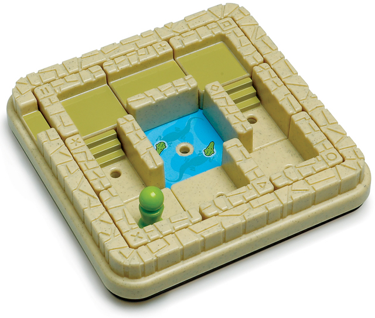

There are 8 different tiles, each with 4 different orientations. 
Note that some tiles are equivalent. 
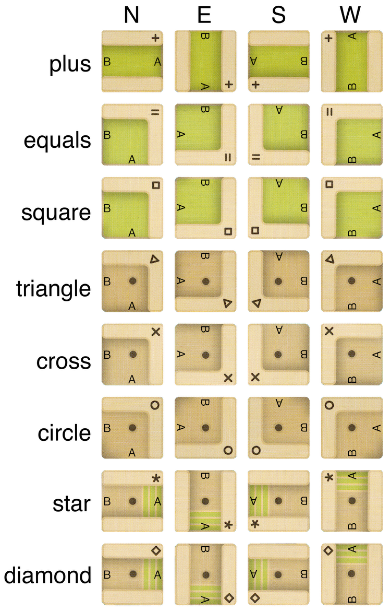

Notice that each tile has two exits, one of which is marked as 'A' and the other
as 'B'. This marking of exits will be important in later tasks in this assignment.

A game starts with all tiles placed on the board. Each tile may be rotated to generate this initial state, 
but the tiles *cannot* be rotated once they have been placed. They must only be slid into an adjacent position.
The game also starts with a 'peg' (called an 'adventurer' in the official rules) located on a tile.

## Objective

The objective of the game is to slide the tiles in such a way as to allow the
peg to move out of the maze at the top left corner. 
Each objective defines a particular starting position for the tiles and peg. 

A sample objective initial state is shown here:

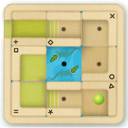

This is objective 1 from the original board game, and is easy to
solve.

The game is successfully completed once the peg can move *validly* off the board.
(See the *Rules* section below).

The game comes with 60 pre-defined objectives, organized as five
difficulty levels from *starter* to *wizard*.

Each time the game is played, the objective may be different.
Some objectives are easier to solve than others.  The game is designed so
that the player may specify a difficulty level.  In the real game there are 
five difficulty levels, each with 12 different possible objectives.
In our version, the user may select the level of difficulty on a slider.

The images below show a possible progression of the above sample
objective. 

 
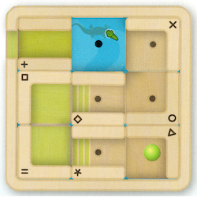
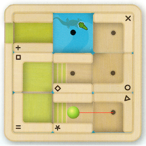
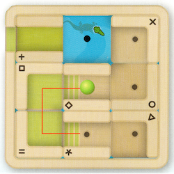

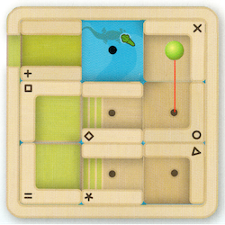
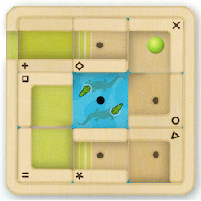
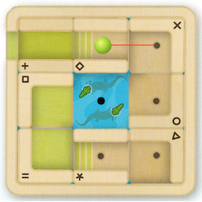
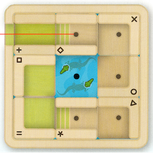

Notice that the Peg cannot stop on a GREEN tile, but can stop on a BROWN tile.
We define a peg *"Step"* as moving the peg from a given exit on its origin to the next *valid* stopping point.
This definition is particularly important for some of the later tasks.

You can find visual representations of all of the objectives in the
`src/comp1110/ass1/gui/assets` [folder](src/comp1110/ass1/gui/assets),
each as a png image, named `<objective number>.png`.

We have provided you with a
[paper version of the game](assets/papergame.pdf), which you can print
out and use to help you visualise the game if you wish.

### Positions

In our game we encode `positions` on the board as an int from 0 to 8 as follows:

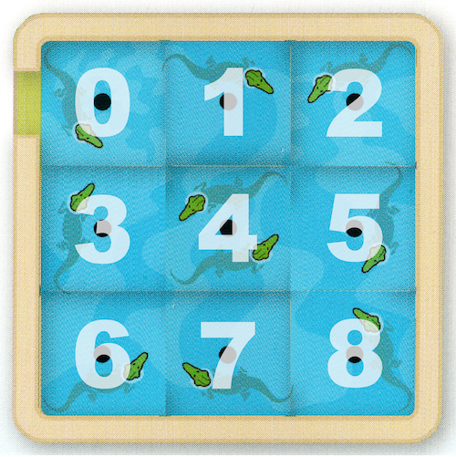

### Encoding of Tile and Peg Locations

A tile is encoded as a two-character string.

1. The orientation of the tile: `N` (NORTH), `S` (SOUTH), `E` (EAST), or `W` (WEST)
3. The position of the tile: `0` to `8`.

The location of the `peg` is encoded as a one-character string as follows:

1. The position of the peg: `0` to `8`

### TileTypes and TileNames

#### TileName: 

Each tile has a name, and a symbol representing that name. These can be seen in the
image of tile orientations at the top of the page. More information can be found 
in the `TileName` [class](src/comp1110/ass1/TileName.java). 

#### TileType:

Each Tile has a TileType that defines the Type of tile it is. 
There are 4 different tile types. 

- `STRAIGHT`  --- `PLUS` `+`
- `GREEN_CORNER` --- `EQUALS` `=`, `SQUARE` `□`
- `BROWN_CORNER` --- `TRIANGLE` `△`, `CROSS` `x`, `CIRCLE` `○`
- `STAIRWAY` --- `STAR` `*`, `DIAMOND` `◇`

The peg may only move between two tiles if they are the same type or they are the same colour
(see the image of tile orientations). 
For example: the peg may move between a `GREEN_CORNER` and a `STRAIGHT` tile (they're both green) but it may not
move directly between a `BROWN_CORNER` and a `GREEN_CORNER` (they are different colours).

Notice that `STAIRWAY` tiles are both green and brown. A peg may move between any tile and a
`STAIRWAY` tile, so long as the `STAIRWAY` tile is in the correct orientation (ie: the colours match up).  

More information can be found in the `TileType` [class](src/comp1110/ass1/TileType.java)

## The Rules

The rules of the game are fairly simple and are as follows: 

- Tiles may not be rotated or removed from the board.
- Tiles may be slid only into an adjacent space that does not contain a tile.
- A Tile that is occupied by the Peg may not be moved until the Peg no longer occupies it.
- The Peg may only stop on a `'BROWN_CORNER'` or `'STAIRWAY'` tile (tileTypes `*` to `x`). 
    - If you look at the pictures of the tiles, you'll notice that each tile has a black dot in the center
    if the peg is allowed to stop there.
- The Peg may only move between a `BROWN_CORNER` and `GREEN_CORNER`/`STRAIGHT` tile via a `STAIRWAY` in the correct orientation.
- The Peg may not move across the empty space (water with crocodiles on it!)
- The puzzle is complete when the Peg is able to exit the maze via the green exit found on the top-left of the board
    - Notice that the exit is green: it must be connected to either a `STRAIGHT` tile or a `STAIRWAY` tile in the correct orientation.

## Objective Encoding

In our game, the initial state of the game is encoded as a string that represents the initial
tile and peg placements. The first 16 characters define the tile placements, and the final character 
defines the peg placement. The first objective is defined by the following string: 
"S0S6W3N8N2E5S7S18"

Each individual tile placement appears in the string in order of the tileType.
See the image of all tile rotations above to see the order (from top to bottom). 
Exhaustively, this initial state means: 

- Tile `+` is in orientation SOUTH and position 0. 
- Tile `=` is in orientation SOUTH and position 6. 
- Tile `□` is in orientation WEST and position 3. 
- Tile `△` is in orientation NORTH and position 8.
- Tile `x` is in orientation NORTH and position 2.
- Tile `○` is in orientation EAST and position 5.
- Tile `*` is in orientation SOUTH and position 7. 
- Tile `◇` is in orientation SOUTH and position 1. 
- Peg is in position 8.

The `Objective` [class](src/comp1110/ass1/Objective.java) has all of
the objectives encoded for you already (they can be seen visually
[here](src/comp1110/ass1/gui/assets)).

### Solution Encoding

One of the High Distinction tasks in this assignment is to write a program that
will solve any given objective in this game. We define a solution encoding as
a string comprising multiple 'moves'. A 'move' is defined as either moving a Tile
to an adjacent empty space or moving the peg one 'Step' (for a definition of a
peg 'Step', please look at the 'Objective' section in this file). Any move is
represented as follows:

1. The ID of the object being moved. If it is a Tile, this would be its shape,
eg. "□" or "x". If it is a peg, it is "p".
2. The direction in which it is being moved. This can be either "N", "E", "S", "W"
(corresponding to the first letter of each cardinal direction). In the case of a
peg step, this section can be comprised of multiple directions if the peg has to
move across multiple Tiles to arrive at one where it can stop (that is, one with
a hole in it).

The solution for the sample Objective shown above is `◇SpWpWNEpEpN◇NpWpWW`. Notice
that the subsection "pWNE" corresponds to the peg moving West, North and then East
in one step. This is because the peg cannot stop at green Tiles, so one peg
step corresponds to three individual movements.

### Your task

Unfortunately your version of the assignment has some missing code.
While the graphical user interface is complete, some of the important
logic is missing, so it won't work as described above.  It is your job
to fix the problems, each identified by a `FIXME` comment in the
source code, so that the code works.  Do not change the code except by
following each of the assigned tasks.  When those tasks are completed,
the game will function correctly.  Check your changes by using the
provided unit tests.

## Legal and Ethical Issues

First, as with any work you do, you must abide by the principles of
[honesty and integrity](https://cs.anu.edu.au/courses/comp1110/09-integrity/). I
expect you to demonstrate honesty and integrity in everything you do.

In addition to those ground rules, you are to follow the rules one
would normally be subject to in a commercial setting. In particular,
you may make use of the works of others under two fundamental
conditions: a) your use of their work must be clearly acknowledged,
and b) your use of their work must be legal (for example, consistent
with any copyright and licensing that applies to the given material).
**Please understand that violation of these rules is a very serious
offence.** However, as long as you abide by these rules, you are
explicitly invited to conduct research and make use of a variety of
sources. You are also given an explicit means with which to declare
your use of other sources (via originality statements you must
complete). It is important to realize that you will be assessed on the
basis of your original contributions to the project. While you won't
be penalized for correctly attributed use of others' ideas, the work
of others will not be considered as part of your
contribution. Therefore, these rules allow you to copy another
student's work entirely if: a) they gave you permission to do so, and
b) you acknowledged that you had done so. Notice, however, that if you
were to do this you would have no original contribution and so would
receive no marks for the assignment (but you would not have broken any
rules either).

## Evaluation Criteria

**The mark breakdown is described on the
[deliverables](https://cs.anu.edu.au/courses/comp1110/assessments/deliverables/#D1A) page.**

**Pass**
* Tasks #1, #2, #3, #4, #5, and #6

**Credit**
* Tasks #7, #8, and #9 *(in addition to all tasks required for Pass)*

**Distinction**
* Tasks #10 and #11 *(in addition to all tasks required for Credit)*

**High Distinction**
* Tasks #12 and #13 *(in addition to all tasks required for Distinction)*

**IMPORTANT NOTE:** *It is very important that you understand that you are* **not**
*required to complete all elements of the
assignment. In fact, you are not encouraged to pursue the Distinction and High
Distinction tasks unless you feel motivated and able to do so. Recall that the
assignment is redeemable against the exam. The last parts of the assignment are
significantly harder than the others, but together worth only one additional mark. I
don't encourage you to spend too much time on this unless you are enjoying the
challenge of solving these harder problems.  Solutions to tasks #12 and #13
involve ideas that I have* **not covered**, *or not covered deeply in class; you may
need to go beyond the course material.*

