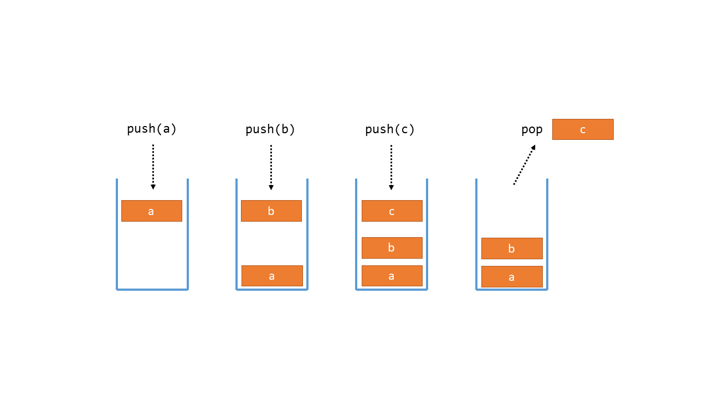

# COMP1110 Lab 8

## Before the Lab 

* Complete week 9 of your personal journal, commit and push at least 5 minutes prior to your lab.
* Make sure you've covered modules [**A1**](https://cs.anu.edu.au/courses/comp1110/lectures/oo/#A1) (Lists 1) and [**A2**](https://cs.anu.edu.au/courses/comp1110/lectures/oo/#A2) (Lists 2).

## Purpose 

In this lab you will:
* implement the *Stack* abstract data type using an array as the underlying data structure;
* practice using recursion to solve a search problem; and
* become familiar with the format of exam questions used in this course.

**It is important to complete this lab.   Your tutor will mark your engagement during the lab.**  You will receive a mark of 0.9 for full engagement and a small bonus (a mark of 1.0) if you completed all the tasks during the lab (your tutor will use the CI to check this --- you don't need to be marked off).

## Part I: 30-Minute Check-In

As usual, you will do _two_ things during the 30-minute check-in:

1.  Check in with **your tutor** together with the other members of your group.    Briefly outline any issues you're having that you'd particularly like help with during the lab (make sure you have your journal open and refer to it when you meet with your tutor).
2.  When you're not doing your check-in with your tutor, you should be listening to the **lab leader** as they give an overview of what you'll be going through in this week's lab.

## Part II:  Your Lab Tasks

You have two exercises this week: [FamilyTree](FamilyTree.java) and [ArrayStack](ArrayStack.java). Both of these exercises were final exam questions in Semester 1 2020 (like CropRotation from Lab 7), so they will be good practice leading up to your final exam. 

Unlike previous weeks, we have not created a step-by-step guide for solving these questions. The questions appear as they did in the final exam and all the information you need is self-contained within those Java files. While we aren't walking you through the problem, your tutors are still more than happy to answer questions! The purpose of these problems is to give you more practice with ADTs, recursion and the exam question format, and to build your confidence in solving programming problems.

### Stack

A *stack* is an abstract data type that allows elements to be added and removed in a last-in, first-out order.
A stack typically supports the following operations:
* push: adds an element to the top of the stack
* pop: removes and returns the element at the top of the stack
* peek: returns the element at the top of the stack, but does not remove it

Elements may only be added or removed at the top of the stack; any element underneath the topmost element cannot be removed without first removing the topmost element.

A stack may also support operations to query its size, or check whether an element is contained in the stack.
In this exercise you will implement a stack using an array data structure to store the elements.
